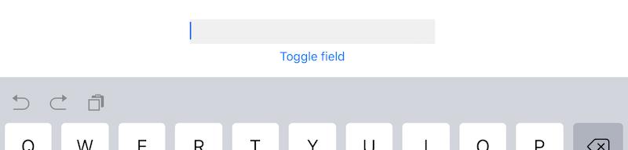
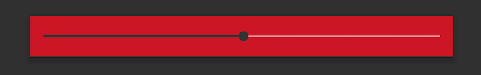
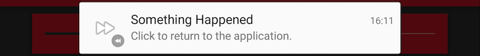

# Titanium 5.0.0 Sample App

This sample app demonstrates as much of the new APIs introduced in Titanium 5.0. Since this release is a big one, we've created separate sample apps for:

* WatchOS 2 Connectivity: [WatchSession Sample App](https://github.com/appcelerator-developer-relations/appc-sample-watchos2)
* iOS App Search: [App Search Sample App](https://github.com/appcelerator-developer-relations/appc-sample-appsearch)
* iOS Handoff: [Handoff Sample App](https://github.com/appcelerator-developer-relations/appc-sample-handoff)

We're working on a sample to demonstrate [Windows Runtime Direct API Access](http://docs.appcelerator.com/platform/latest/#!/guide/Windows_Runtime_Direct_API_Access) as well as the [Hyperloop Module for iOS](http://labs.appcelerator.com/project/55f74a9f421c44837717716b/Hyperloop-Module) now available via Appcelerator Labs.

For a lists of all the changes see the [release notes](http://docs.appcelerator.com/platform/release-notes/?version=5.0.0.GA) and linked JIRA filters.

## iOS: Icons & Launch Images
To support [App Thinning](https://developer.apple.com/library/prerelease/ios/documentation/IDEs/Conceptual/AppDistributionGuide/AppThinning/AppThinning.html) we now generate [Asset Catalogs](https://developer.apple.com/library/ios/recipes/xcode_help-image_catalog-1.0/chapters/Recipe.html) for the app icons and launch images. In most cases you won't notice, but be aware that:

* You no longer need to have any `appicon*.png` files in `assets/iphone`. Just provide a 1024x1024 24-bit [DefaultIcon.png](DefaultIcon.png) in your project root and Titanium will generate the missing required sizes for you.
* The build will fail if your icons do not meet Apple requirements and you don't provide a valid `DefaultIcon.png`.
* You can no longer use launch images within the app itself [like this](http://www.tidev.io/2015/01/06/how-to-re-use-the-launch-image-in-the-app/).
* [Localized Splash Screens](http://docs.appcelerator.com/platform/latest/#!/guide/Icons_and_Splash_Screens-section-29004897_IconsandSplashScreens-LocalizedSplashScreens) still work, but App Thinning for these images will not because Launch Images do not support localized Asset Catalogs.

For more information see the [iOS graphic asset requirements and options](http://docs.appcelerator.com/platform/latest/#!/guide/Icons_and_Splash_Screens-section-29004897_IconsandSplashScreens-iOSgraphicassetrequirementsandoptions) guide. We will add support for `DefaultIcon.png` to the other platforms soon. Bye bye [TiCons](http://ticons.fokkezb.nl) ;)

## Attributed Strings
The [Attributed Strings](app/controllers/attributedstrings.xml) sample demonstrate the use of the new Alloy `<AttributedString>` proxy property. You can use this as a child element of `<Label>`, `<TextArea>` and `<TextField>`. As you can see the last one also supports `<AttributedHintText>`.

For iOS only we've also added support for the attribute type [`ATTRIBUTE_LINE_BREAK`](http://docs.appcelerator.com/platform/latest/#!/api/Titanium.UI-property-ATTRIBUTE_LINE_BREAK). Use this with one of the `Ti.UI.ATTRIBUTE_LINE_BREAK_BY_*` constants found in the sample's [TSS](app/styles/attributedstrings.tss) to determine how lines break.

## Alloy Themes
Apart from `tiapp.xml` you can now theme [almost everything](https://jira.appcelerator.org/browse/ALOY-1307). We've added support for `i18n`, `lib` and `platform` folders. If you have a white-label app you can now easily brand strings, libraries and Android icons, splash screens and themes.

### Sample
The [Alloy](app/controllers/tialloy.xml) sample demonstrates all three new theming features. The last one for Android only, where it should show the [thumbs up](app/themes/foo/platform/android/res/drawable-xhdpi/thumbsup.jpg) image of the theme, not the default [thumbs down](platform/android/res/drawable-xhdpi/thumbsup.jpg).

## Alloy Event Management
Alloy controllers have 3 new APIs to manage event listeners for Titanium view proxies. All events you [add via XML](http://docs.appcelerator.com/platform/latest/#!/guide/Alloy_XML_Markup-section-35621528_AlloyXMLMarkup-EventHandling) now use [`$.addListener(proxy, type, callback)`](http://docs.appcelerator.com/platform/latest/#!/api/Alloy.Controller-method-addListener) which is also available to you in the controller. Use [`$.getListener([proxy], [type])`](http://docs.appcelerator.com/platform/latest/#!/api/Alloy.Controller-method-getListener) to get all callbacks or only for a specific proxy and/or event type. Finally [`$.removeListener([proxy], [type], [callback])`](http://docs.appcelerator.com/platform/latest/#!/api/Alloy.Controller-method-removeListener) can be used to remove all or specific event listeners. Just like [`$.destroy()`](http://docs.appcelerator.com/platform/latest/#!/api/Alloy.Controller-method-destroy) you can call this when the controller's UI is "closed" to avoid memory leaks, e.g. by calling it in a Window `close` event.

### Sample
In the [Alloy](app/views/tialloy.xml) sample you will find that we add the same callback as listener to the different events on the first button. In the [controller](app/controllers/tialloy.js) you can see that the second button needs only one line of code to remove all listeners from that first button. While you're in the controller, also observe that when the controller is created we add a third tracked listener to the first button before logging all tracked listeners. When the window closes we remove all event listeners to any proxy or event in one call. See the console logs for details.

## More Alloy
The [Alloy](app/views/tialloy.xml) sample also demonstrates the following new features:

* You can now use `Alloy.CFG.*` properties in [XML](app/views/tialloy.xml).
* As well as `Alloy.Globals.*` variables.

## iOS APIs
The [iOS](app/views/ios.xml) sample demonstrates a few new API's:

* After MobileWeb and Windows Phone, iOS now also supports [Ti.UI.ActivityIndicator.indicatorColor](http://docs.appcelerator.com/platform/latest/#!/api/Titanium.UI.ActivityIndicator-property-indicatorColor) to set the color of the indicator.
* For iPad-only, use [showUndoRedoActions](http://docs.appcelerator.com/platform/latest/#!/api/Titanium.UI.TextArea-property-showUndoRedoActions) on TextFields and TextAreas to determine if iOS 9 should show the undo/redo and copy/paste actions in the toolbar above the soft keyboard. Be aware of [TIMOB-19614](https://jira.appcelerator.org/browse/TIMOB-19614) when toggling this property.

## Android Themes
This release introduces new predefined Titanium themes for Android to hide the action bar and optionally the status bar:

* `Theme.AppCompat.NoTitleBar`: Hides the action and title bar
* `Theme.AppCompat.NoTitleBar.Fullscreen`: Hides the above plus the status bar.

There are four ways to use the existing and new built-in themes:

1. Set the `android:theme` attribute of the Android manifest `application` element in [tiapp.xml](tiapp.xml) to `@style/` plus the theme name to apply it to use it as default for all windows.
2. Set the `parent` attribute of your custom theme `style` element to `@style/` plus the theme name.
3. Use it for an individual Window via the creation-only `theme` property.
4. Instead, set `<navbar-hidden>` or `<fullscreen>` to `true` in [tiapp.xml](tiapp.xml) to select `Theme.AppCompat.NoTitleBar` or `Theme.AppCompat.NoTitleBar.Fullscreen`.

### Sample
Play around with the comments in [tiapp.xml](tiapp.xml) to see the different themes in action. You can also change the `parent` attribute of our [custom_theme.xml](platform/android/res/values/custom_theme.xml). Be aware that you need to remove or comment out the `<application>` element to test `<navbar-hidden>` and `<fullscreen>`. The [Android](app/controllers/android.js) sample demonstrates the use of a window's `theme` property.  when using a window's `theme` property

> **NOTE:** If you use a TabGroup in your app then you can not use a theme without action bar. Also be aware of [TIMOB-19613](https://jira.appcelerator.org/browse/TIMOB-19613).

## Android Elevation
Since Titanium 3.3 iOS has [viewShadowOffset](http://docs.appcelerator.com/platform/latest/#!/api/Titanium.UI.View-property-viewShadowOffset) and now Android gets [elevation](http://docs.appcelerator.com/platform/latest/#!/api/Titanium.UI.View-property-elevation). Is it the same? Let [Google explain](https://www.google.com/design/spec/what-is-material/elevation-shadows.html#elevation-shadows-elevation-android-) why it's not.

### Sample
The [android](app/views/android.xml) sample demonstrates this new property. Use the slider to change the elevation value. As the [TSS](app/styles/android.tss) shows you need to make sure your view has some space around it or else the parent will clip the elevation shadow. The view also needs a `backgroundColor` since a transparent view wouldn't cast much shadow.

## Other Android APIs
This release supports adding a large icon to be shown in the content area of a notification. As the [android](app/controllers/android.js) sample demonstrates simply set the [Ti.Android.Notification.largeIcon](http://docs.appcelerator.com/platform/latest/#!/api/Titanium.Android.Notification-property-largeIcon) property to a system or app drawable, like the big fast forward icon I use:

Also new is [Ti.UI.Picker.selectionOpens](http://docs.appcelerator.com/platform/latest/#!/api/Titanium.UI.Picker-property-selectionOpens) which determines whether calling the method `setSelectedRow()` also opens the picker. Tap the button under the picker to see it in action.

## CLIs
Not demonstrated in the sample, but definitely worth mentioning are some new features in the different CLIs:

### Appcelerator CLI
Also new on the CLI front are two command for the Appcelerator CLI. The `info` commands combines the results from `appc ti info` with information about Appcelerator CLI Installer and Core Package. The other allows you to switch to another org without needing to logout and in again. Pass `--org-id <id>` if you know the ID. We're [working](https://jira.appcelerator.org/browse/TISTUD-7504) on making this easier in Studio as well.

	appc info
		Display development environment information
	appc switch org [options]
		switch logged in org

### Titanium CLI
If you clean a project in Studio or via CLI using `[appc] ti clean` it used to only clean the `build` folder, but now it also cleans the `Resources` folder if it's an Alloy project. Whenever you run into an issue, always first clean to rule out any errors introduced by the incremental builds we do to speed up your development workflow.

### Alloy CLI
Thanks to a PR by Kosuke Isobe Alloy now has some of the new commands Kosuke introduced in [alloy-smelter](https://www.npmjs.com/package/alloy-smelter):

	[appc] alloy copy <source> <destination>
		copy the controller, view, and style files from <source> to <destination>

	[appc] alloy move <source> <destination>
		move the controller, view, and style files from <source> to <destination>

	[appc] alloy remove <source>
		remove the controller, view, and style files at <source>

## Windows
Alloy now supports `<CommandBar>` for Windows

-----------------

## Other APIs

### [Alloy](https://github.com/appcelerator/alloy/releases)

* CommandBar

------------------

## Windows

<table>
  <tr><td>Titanium.Media.AudioPlayer.change</td><td>event</td><td>
Fired when the state of the playback changes. (Added support for Windows Phone.)
</td></tr>

  <tr><td>Titanium.Media.AudioPlayer.complete</td><td>event</td><td>
Fired when the audio has finished playing. (Added support for Windows Phone.)
</td></tr>

  <tr><td>Titanium.Media.AudioPlayer.error</td><td>event</td><td>
Fired when there's an error. (Added support for Windows Phone.)
</td></tr>

  <tr><td>Titanium.Media.Sound.change</td><td>event</td><td>
Fired when the state of the playback changes. (Added support for Windows Phone.)
</td></tr>

  <tr><td>Titanium.Media.Sound.complete</td><td>event</td><td>
Fired when the audio has finished playing. (Added support for Windows Phone.)
</td></tr>

  <tr><td>Titanium.Media.Sound.error</td><td>event</td><td>
Fired when an error occurs while playing the audio. (Added support for Windows Phone.)
</td></tr>

  <tr><td>Titanium.Media.VideoPlayer.complete</td><td>event</td><td>
Fired when movie playback ends or a user exits playback. (Added support for Windows Phone.)
</td></tr>

  <tr><td>Titanium.Media.VideoPlayer.error</td><td>event</td><td>
Fired when movie playback encounters an error. (Added support for Windows Phone.)
</td></tr>

  <tr><td>Titanium.UI.Clipboard</td><td>object</td><td>
A module used for accessing clipboard data. (Added support for Windows Phone.)
</td></tr>

  <tr><td>Titanium.UI.ScrollView.canCancelEvents</td><td>property</td><td>
Determines whether this scroll view can cancel subview touches in order to scroll instead. (Added support for Windows Phone.)
</td></tr>

  <tr><td>Titanium.UI.ScrollView.contentOffset</td><td>property</td><td>
X and Y coordinates to which to reposition the top-left point of the scrollable region.
 (Added support for Windows Phone.)
</td></tr>

  <tr><td>Titanium.UI.ScrollView.decelerationRate</td><td>property</td><td>
The deceleration rate of the ScrollView. (Added support for Windows Phone.)
</td></tr>

  <tr><td>Titanium.UI.ScrollView.disableBounce</td><td>property</td><td>
Determines whether scroll bounce of the scrollable region is enabled. (Added support for Windows Phone.)
</td></tr>

  <tr><td>Titanium.UI.ScrollView.horizontalBounce</td><td>property</td><td>
Determines whether horizontal scroll bounce of the scrollable region is enabled. (Added support for Windows Phone.)
</td></tr>

  <tr><td>Titanium.UI.ScrollView.maxZoomScale</td><td>property</td><td>
Maximum scaling factor of the scrollable region and its content. (Added support for Windows Phone.)
</td></tr>

  <tr><td>Titanium.UI.ScrollView.minZoomScale</td><td>property</td><td>
Minimum scaling factor of the scrollable region and its content. (Added support for Windows Phone.)
</td></tr>

  <tr><td>Titanium.UI.ScrollView.overScrollMode</td><td>property</td><td>
Determines the behavior when the user overscolls the view. (Added support for Windows Phone.)
</td></tr>

  <tr><td>Titanium.UI.ScrollView.scrollIndicatorStyle</td><td>property</td><td>
Style of the scrollbar. (Added support for Windows Phone.)
</td></tr>

  <tr><td>Titanium.UI.ScrollView.scrollType</td><td>property</td><td>
Limits the direction of the scrollable region, overriding the deduced setting. Set to 
<code>horizontal</code> or <code>vertical</code>.
 (Added support for Windows Phone.)
</td></tr>

  <tr><td>Titanium.UI.ScrollView.scrollsToTop</td><td>property</td><td>
Controls whether the scroll-to-top gesture is effective. (Added support for Windows Phone.)
</td></tr>

  <tr><td>Titanium.UI.ScrollView.setZoomScale</td><td>method</td><td>
Sets the value of the Titanium.UI.ScrollView.zoomScale property. (Added support for Windows Phone.)
</td></tr>

  <tr><td>Titanium.UI.ScrollView.verticalBounce</td><td>property</td><td>
Determines whether vertical scroll bounce of the scrollable region is enabled. (Added support for Windows Phone.)
</td></tr>

  <tr><td>Titanium.UI.ScrollView.zoomScale</td><td>property</td><td>
Scaling factor of the scroll view's content. (Added support for Windows Phone.)
</td></tr>

  <tr><td>Titanium.UI.Switch.color</td><td>property</td><td>
Color to use for switch text, as a color name or hex triplet. (Added support for Windows Phone.)
</td></tr>

  <tr><td>Titanium.UI.Switch.enabled</td><td>property</td><td>
Determines whether the switch is enabled. (Added support for Windows Phone.)
</td></tr>

  <tr><td>Titanium.UI.Switch.titleOff</td><td>property</td><td>
Text to display on the switch in its "off" state, when the toggle button style is in use. (Added support for Windows Phone.)
</td></tr>

  <tr><td>Titanium.UI.Switch.titleOn</td><td>property</td><td>
Text to display on the switch in its "on" state, when the toggle button style is in use. (Added support for Windows Phone.)
</td></tr>

  <tr><td>Titanium.UI.View.backgroundImage</td><td>property</td><td>
Background image for the view, specified as a local file path or URL. (Added support for Windows Phone.)
</td></tr>

  <tr><td>Titanium.UI.View.zIndex</td><td>property</td><td>
Z-index stack order position, relative to other sibling views. (Added support for Windows Phone.)
</td></tr>

<tr>
</table>